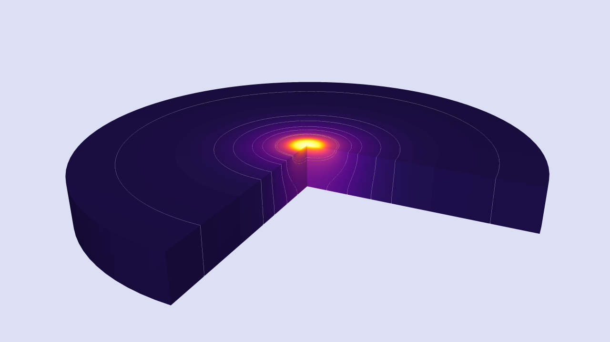

OptiPuls: numerical model for single spot pulsed laser beam welding
===================================================================

This repository contains a numerical model for simulation and optimization of the single spot pulsed laser beam welding of aluminium alloys. Its implementation relies on the [FEniCS computing platform](https://fenicsproject.org/). 

---

**Author:** Dmytro Strelnikov <dmytro.strelnikov@math.tu-chemnitz.de>  
**Funding:** Funding: Project IGF 20.826B (DVS I2.3005) in Forschungsvereinigung Schweißen und verwandte Verfahren e.V. of the [Deutschen Verbandes für Schweißen und verwandte Verfahren e.V.](https://www.die-verbindungs-spezialisten.de/)  
**Project page:** [Simulation Based Optimization of the Time-Dependent Pulse Power for Laser Beam Welding of Aluminum Alloys in Order to Avoid Hot Cracks](https://www.tu-chemnitz.de/mathematik/part_dgl/projects/optipuls/index.en.php)

---





## Requirements

A working [FEniCS](https://fenics.readthedocs.io/en/latest/installation.html) setup is required to run the code as well as `numpy` and `matplotlib` Python packages. ParaView is recommended to visualize the simulation output.

One of the easy ways to satisfy the dependencies would be using the official [FEniCS docker images](https://fenics.readthedocs.io/projects/containers/en/latest/).


## Numerical experiments

Some commits are tagged as `experiments/*` and typically have neither children nor branches pointing at them. These commits are supposed to represent fully reproducible numerical experiments/simulations. The experiment setting is normally explained in the commit message.

The following command is used to tag a certain commit as an experiment:
```
git tag experiments/$(git rev-parse --short HEAD)
```

Use the following command to list all of such commits:
```
git show -s --tags=experiments --decorate --abbrev-commit --pretty=medium
```


## Running simulations and optimizations

### On bare metal

If your host system provides the dependencies then you can run a simulation by
```
python3 run.py [--scratch /path/to/scratch]
```

where `/path/to/scratch` is an optional path to the desired directory for the simulation artifacts such as plots, ParaView files, dumped NumPy arrays, log files, etc.

For the up-to-date list of command line arguments run `python3 run.py --help`.


### In a docker container

Assuming that `/scratch/optipuls` is the desired location for the simulation artifacts and the dijitso cache, the following command will run a simulation (described in the file `run.py`) in the FEniCS docker container:
```
$ docker run \
  -v $(pwd):/home/fenics/shared \
  -v /scratch/optipuls/cache/dijitso:/home/fenics/.cache/dijitso \
  -v /scratch/optipuls:/scratch \
  quay.io/fenicsproject/stable:latest "cd shared && mkdir -p /scratch/$(git rev-parse --short HEAD) && python3 run.py --scratch /scratch/$(git rev-parse --short HEAD)"
```


## Development

The essential development history is reflected by the branch `develop` and various feature branches. The bleeding-edge state of the code is usually reflected by the branch `experimental`. Separate branches are used for preparing talks and publications.


## License

The sorce code is licensed under the terms of [GNU GPLv3](https://www.gnu.org/licenses/gpl-3.0.en.html).
